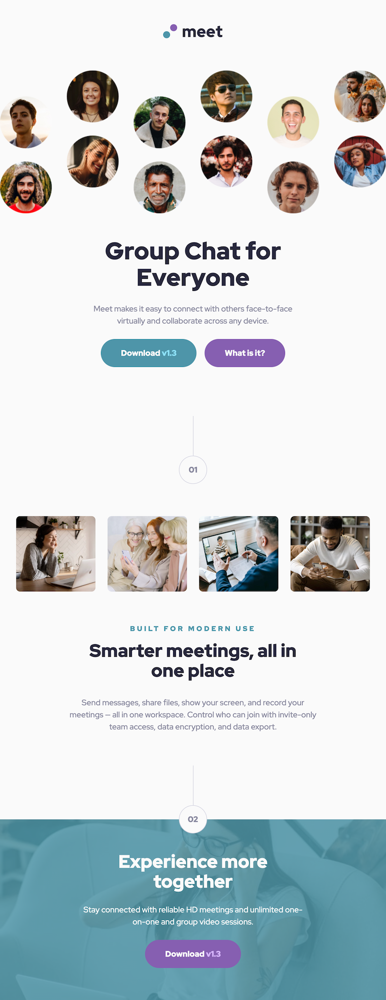
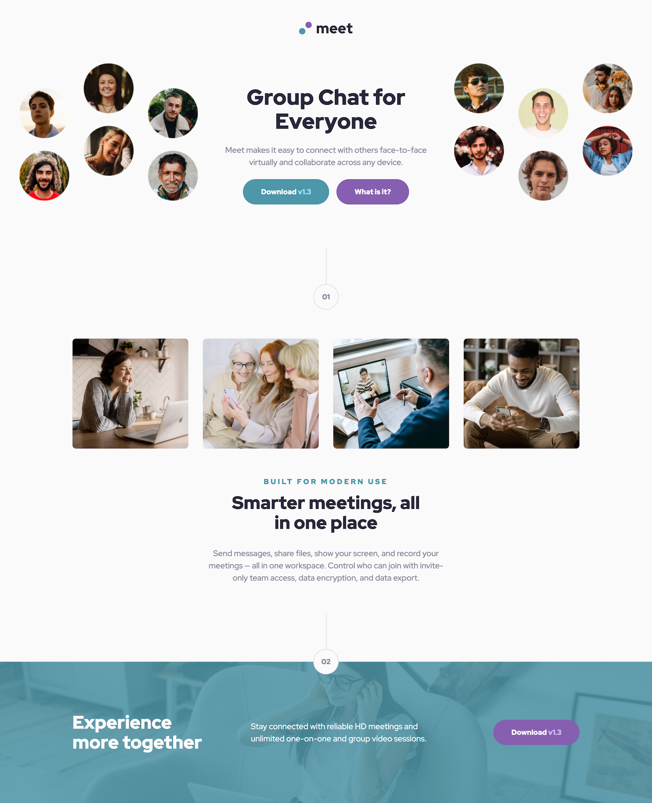

# Frontend Mentor - Meet landing page solution

This is a solution to the [Meet landing page challenge on Frontend Mentor](https://www.frontendmentor.io/challenges/meet-landing-page-rbTDS6OUR). Frontend Mentor challenges help you improve your coding skills by building realistic projects.

## Table of contents

- [Frontend Mentor - Meet landing page solution](#frontend-mentor---meet-landing-page-solution)
  - [Table of contents](#table-of-contents)
  - [Overview](#overview)
    - [The challenge](#the-challenge)
    - [Screenshot](#screenshot)
    - [Links](#links)
  - [My process](#my-process)
    - [Built with](#built-with)
    - [What I learned](#what-i-learned)
    - [Continued development](#continued-development)
    - [Useful resources](#useful-resources)
    - [AI Collaboration](#ai-collaboration)
  - [Author](#author)

## Overview

### The challenge

Users should be able to:

- View the optimal layout depending on their device's screen size
- See hover states for interactive elements

### Screenshot






### Links

- Solution URL: [https://github.com/chiaminchen/meet-landing-page](https://github.com/chiaminchen/meet-landing-page)
- Live Site URL: []()

## My process

### Built with

- Semantic HTML5 markup
- CSS custom properties (Design Tokens)
- Vanilla CSS with CSS Modules
- Flexbox
- CSS Grid
- Mobile-first workflow
- [React 19](https://react.dev/) - JS library
- [Vite 8](https://vite.dev/) - Build tool & dev server

### What I learned

**Fluid Typography with `clamp()`**

Instead of switching font sizes abruptly at breakpoints, I used `clamp()` to make them scale smoothly between a minimum and maximum value across screen widths:

```css
--font-size-h1-mt-fluid: clamp(2.5rem, 2.0229rem + 2.0356vw, 3rem);
```

This eliminates the "snap" effect and feels much more natural on every screen size.

**CSS Design Token System**

Centralising all colours, spacing, font sizes, and radii as CSS custom properties in a single `variables.css` file made the entire project much easier to maintain. Any global change only needs to happen in one place:

```css
:root {
  --color-cyan-600: #4d96a9;
  --spacing-8: 2rem;
  --radius-button: 10rem;
}
```

**`em`-based Media Query Breakpoints**

I learned that `px` breakpoints ignore the user's browser font-size preference, while `em` breakpoints scale with it. For example, `768px` becomes `48em`:

```css
/* Responds correctly even when the user has enlarged their base font */
@media (min-width: 48em) { ... }
```

**Vite Asset Handling**

Images referenced directly inside CSS files bypass Vite's asset pipeline (no hashing, no optimisation, paths can break after build). The correct approach is to import the image in JSX and pass it as an inline style:

```jsx
import FooterBg from '../../assets/images/desktop/image-footer.jpg';

<div style={{ backgroundImage: `url(${FooterBg})` }} />;
```

**Accessibility Fundamentals**

Small markup decisions have a big impact on users who rely on assistive technology:

- `<main>` landmarks let screen reader users jump straight to the content
- `alt=""` on decorative images tells screen readers to skip them
- `:focus-visible` provides keyboard focus styles without affecting mouse users
- `prefers-reduced-motion` respects the OS-level animation preference

### Continued development

- **TypeScript** — Adding static types to component props would catch mistakes at write-time rather than at runtime. The first step would be migrating `.jsx` files to `.tsx` and replacing implicit prop types with explicit interfaces.
- **Component testing** — This project has no tests yet. I want to get comfortable with `vitest` + `@testing-library/react` to cover at least the reusable components (`Button`, `SectionDivider`, `ImageCard`).
- **`<picture>` element and modern image formats** — Providing WebP (and AVIF) sources via `<picture>` alongside JPEG fallbacks can cut image payload by 25–35% with no visible quality loss.
- **Colour contrast tooling** — Integrating an automated contrast-ratio check (e.g. `postcss-colorguard` or Storybook's a11y addon) into the workflow so contrast issues are caught before code review.

### Useful resources

- [MDN — clamp()](https://developer.mozilla.org/en-US/docs/Web/CSS/clamp) — The definitive reference for fluid sizing. The "formal syntax" section helped me understand exactly what the three arguments control.
- [Utopia — Fluid Type Scale Calculator](https://utopia.fyi/type/calculator/) — A visual tool for generating `clamp()` values. Used this to calculate all the fluid font-size tokens in `variables.css`.
- [Josh W. Comeau — The Surprising Truth About Pixels and Accessibility](https://www.joshwcomeau.com/css/surprising-truth-about-pixels-and-accessibility/) — This is what convinced me to switch media query breakpoints from `px` to `em`.
- [WebAIM Contrast Checker](https://webaim.org/resources/contrastchecker/) — Handy for quickly verifying that foreground/background colour pairs meet WCAG AA (4.5:1 for normal text).
- [web.dev — Optimize Cumulative Layout Shift](https://web.dev/articles/cls) — Explained why `width`/`height` attributes on `` matter for CLS and how browsers use them to reserve space before the image loads.

### AI Collaboration

Used Google Antigravity for iterative code review, covering Accessibility (WCAG), HTML semantics, CSS best practices, React patterns, and performance.

## Author

- Frontend Mentor - [@chiaminchen](https://www.frontendmentor.io/profile/chiaminchen)
- Github - [@chiaminchen](https://github.com/chiaminchen)
